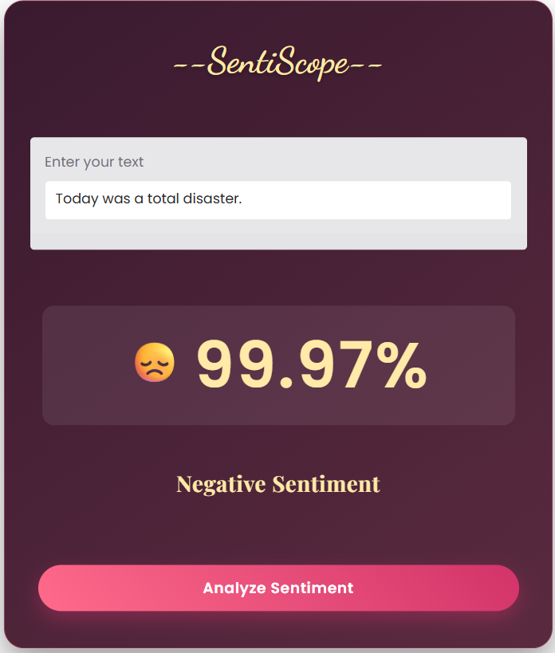

# 🪞 SentiScope 🎭 – AI Sentiment Analyzer

SentiScope is a lightweight yet expressive AI-powered sentiment analysis app that senses the mood behind your words and reflects it back using emojis, glowing visuals, and confidence scores.

🚀 Try the app here: [SentiScope on Hugging Face Spaces](https://huggingface.co/spaces/Ruusheka/SentiScope)

---
## 🖼️ Screenshot

> 📸 _Home screen preview of SentiScope in action:_



---

## ✨ Features

- 🔍 Real-time sentiment detection (Positive / Negative)
- 🧠 Powered by Hugging Face Transformers pipeline
- 💫 Elegant UI with glowing text, emoji animations, and confidence bars
- ⚡ Super lightweight and fast response
- 📱 Mobile-friendly Gradio interface

---

## 🛠️ Tech Stack

| Component       | Details                                    |
|----------------|---------------------------------------------|
| **Frontend**    | Gradio (Python-based UI framework)         |
| **Backend**     | Hugging Face Transformers – Sentiment Pipeline |
| **Model**       | `distilbert-base-uncased-finetuned-sst-2-english` |
| **Deployment**  | Hugging Face Spaces                        |
| **Language**    | Python                                     |

---

## 🧠 How It Works

1. User inputs any text (a tweet, quote, or comment).
2. Text is passed through a pre-trained BERT model for sentiment analysis.
3. The app displays:
   - Emoji-based mood
   - Predicted sentiment label
   - Model confidence level with animated bar
   - Golden glowing UI for aesthetic feedback

---

## 🧪 Run Locally

To run the project on your machine:

```bash
# Clone the repo
git clone https://github.com/Ruusheka/SentiScope.git
cd SentiScope

# Install dependencies
pip install -r requirements.txt

# Run the app
python app.py
